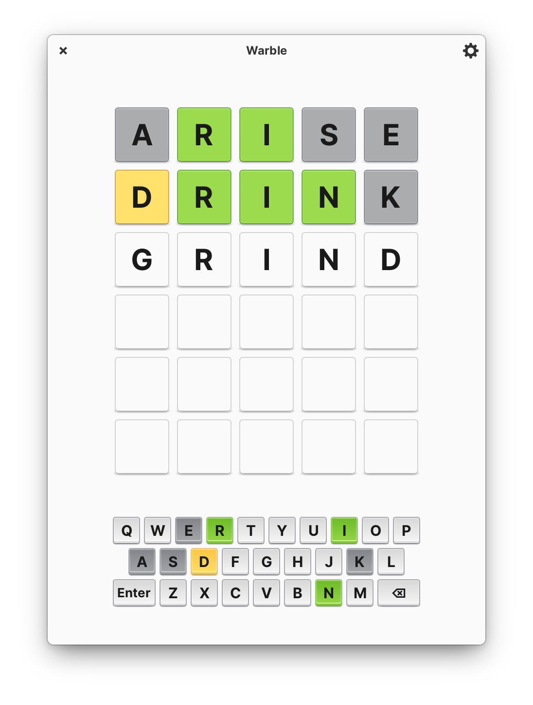
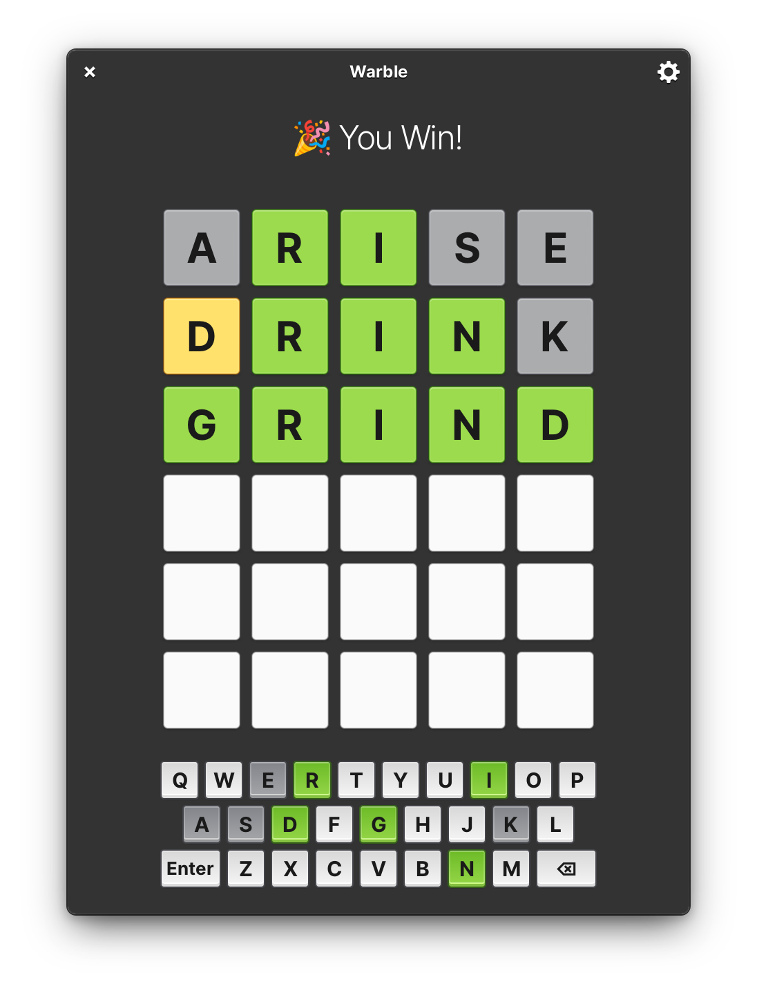
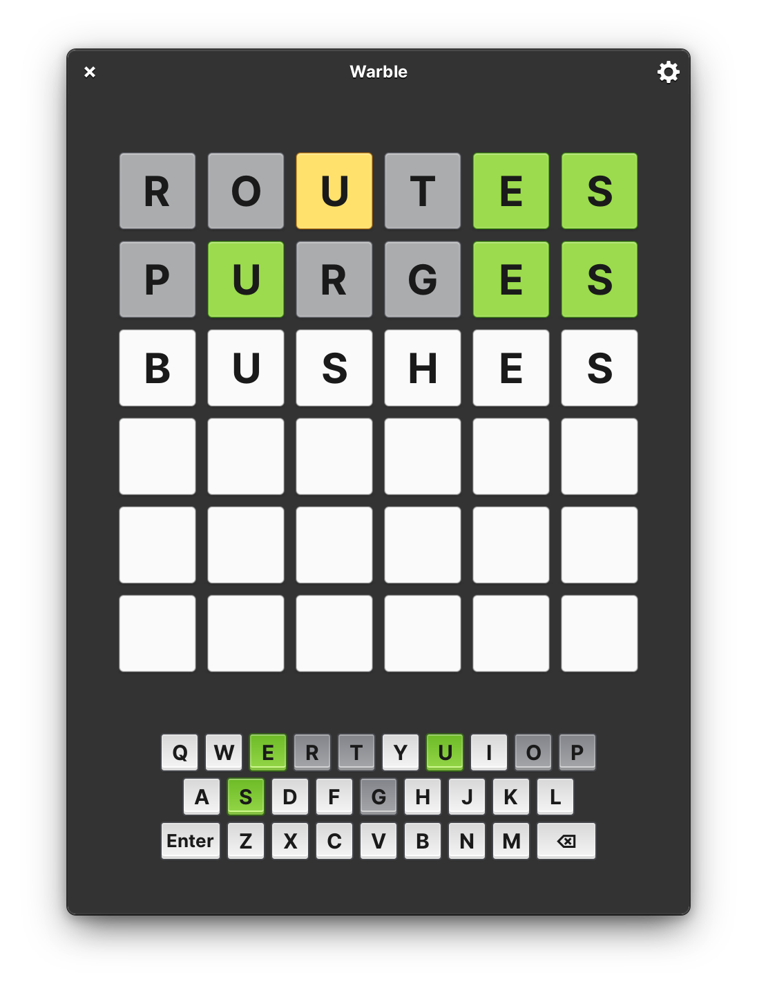
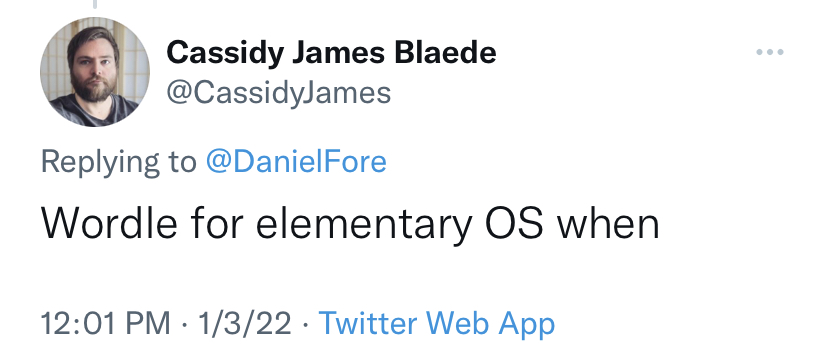

<p align="center">
  
</p>
<h1 align="center">Warble</h1>
<p align="center">
  <a href="https://appcenter.elementary.io/com.github.avojak.warble"></a>
  <a href='https://flathub.org/apps/details/com.github.avojak.warble'></a>
</p>

|  |  |  |
|------------------------------------------------------------------|------------------------------------------------------------------|------------------------------------------------------------------|

## The word-guessing game

Warble is a native Linux word-guessing game built in Vala and Gtk for [elementary OS](https://elementary.io).

Figure out the word before your guesses run out!
- Three difficulty levels
- Almost 5k possible answers
- Need a break? Close the game and automatically pick back up where you left off

<p align="center"></p>

Warble is inspired by (and not affiliated with) the recently popular online game Wordle (which itself is reminiscent of the late 80's game show Lingo). 

## Installation

If you are not on elementary OS, you can install Warble from Flathub:

```bash
$ flatpak install flathub com.github.avojak.warble
```

### Community Packages

The officially supported method of installing Warble is via the flatpak, however there are several other packages maintained by the community for support on other platforms:

| Source | Channel/Branch | Architecture | Version |
| ------ | -------------- | ------------ | ------- |
| Snapcraft | `stable` | </img> | <a href="https://snapcraft.io/warble"></img></a> |
| | `edge` | </img> | <a href="https://snapcraft.io/warble"></img></a> |
| Fedora | `rawhide` | </img> | <a href="https://packages.fedoraproject.org/pkgs/warble/warble/"></img></a> |
|  | `f35` | </img> | <a href="https://packages.fedoraproject.org/pkgs/warble/warble/"></img></a> |
|  | `f36` | </img> | <a href="https://packages.fedoraproject.org/pkgs/warble/warble/"></img></a> |

## Install from Source

You can install Warble by compiling from source using `flatpak-builder`:

```bash
$ flatpak-builder build com.github.avojak.warble.yml --user --install --force-clean
$ flatpak run --env=G_MESSAGES_DEBUG=all com.github.avojak.warble
```

Another helpful environment variable to set is `GTK_DEBUG=interactive` for investigating UI and styling issues.

## Word List

The `dictionary.txt` word list is sourced from [sindresorhus/word-list](https://github.com/sindresorhus/word-list).

## Project Status

This project is very much in-progress and has a lot of remaining work. Check out the [Projects](https://github.com/avojak/warble/projects) page to track progress towards the next milestone.

Please keep in mind that at this time I am developing Warble as a personal project in my limited free time to learn Vala and contribute back to the [elementary OS](https://elementary.io) community, so do not be offended if I reject a pull request or other contribution.

<p align="center"><a href="https://www.buymeacoffee.com/avojak" target="_blank"></a></p>
